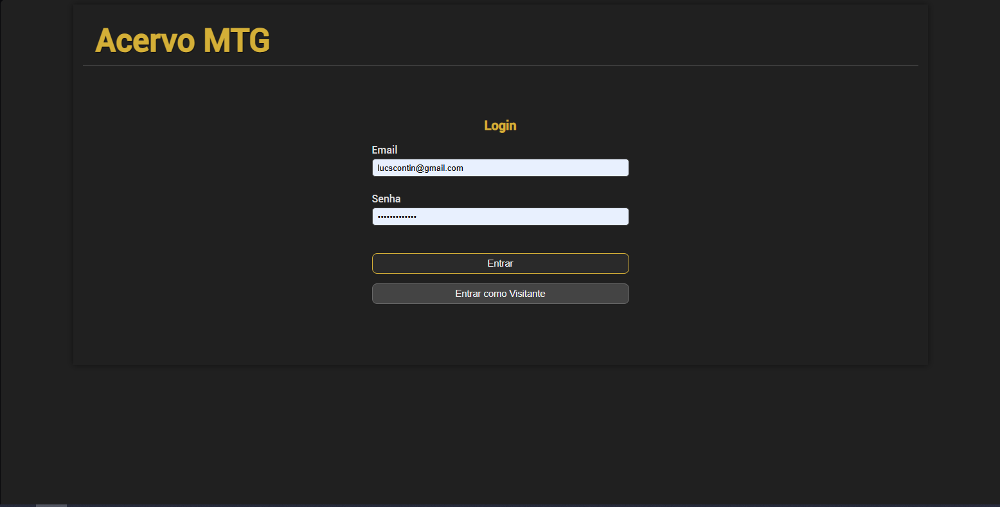
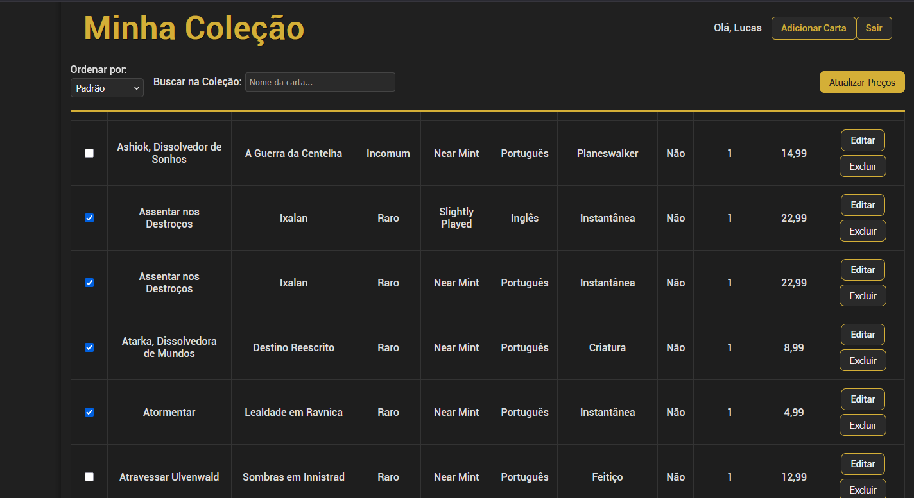
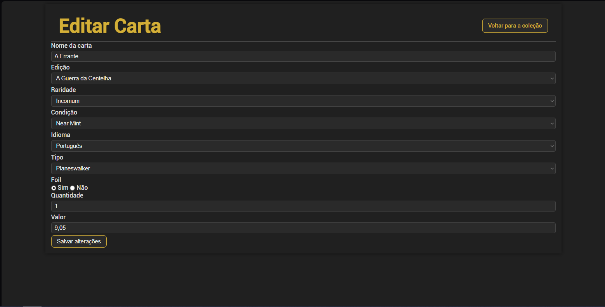
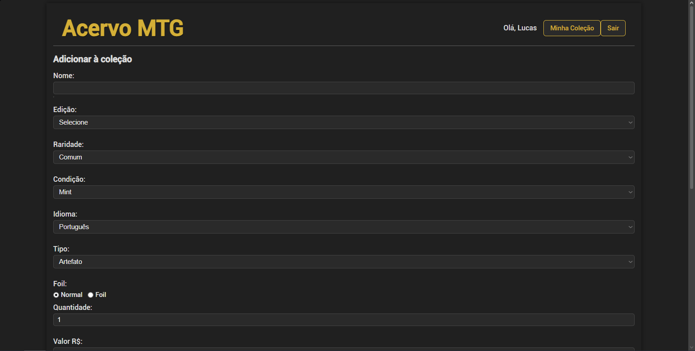
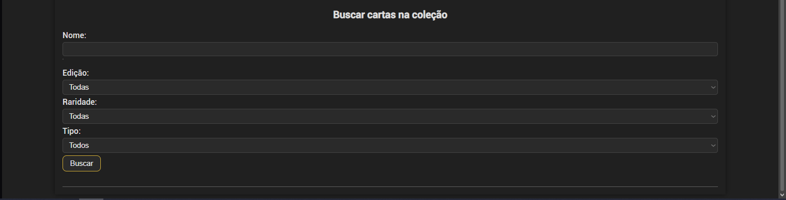
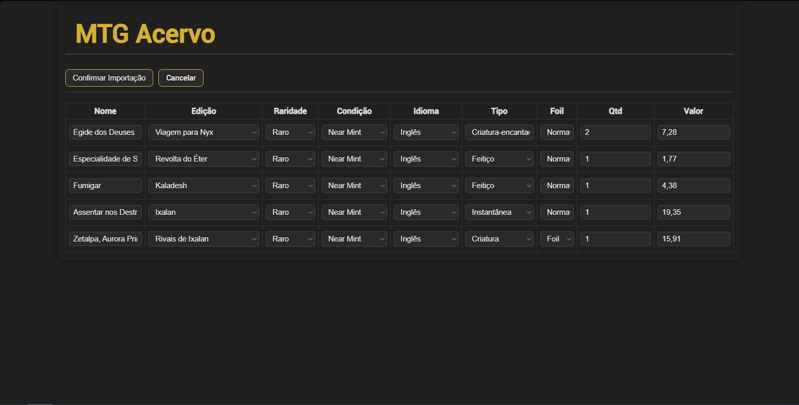

# Acervo MTG

Um gerenciador de coleção e acervo pessoal de cartas de Magic: The Gathering moderno desenvolvido em PHP com integração em tempo real à API do Scryfall e suporte para importação de planilhas.

---

### Versão Atual: `v1.1.0`

---

## Screenshots da Aplicação

| Tela de Login | Coleção / Dashboard | Detalhes e Edição |
| :---: | :---: | :---: |
|  |  |  |

| Adicionar à Coleção | Buscar Carta | Importação de Cartas |
| :---: | :---: | :---: |
|  |  |  |

---

## Funcionalidades

- **Controle de Acesso (Login de Visitante)**: Acesso seguro para gerenciamento administrativo da coleção e opção de login em modo de demonstração (somente leitura) para visitantes.
- **Busca Automatizada (API do Scryfall)**: Campo inteligente com autocompletar que sugere nomes de cartas em tempo real integrado à base de dados oficial.
- **Tradução Inteligente (PT-BR)**: Mapeamento automático de nomes das cartas para Português (PT-BR) integrado à API.
- **Importação em Lote**: Leitura e processamento de dados em lote a partir de arquivos Excel (`.xlsx`, `.xls`) e CSV usando PhpSpreadsheet com tela de mapeamento e preview.
- **Filtros e Ordenação**: Filtre suas cartas por edição, raridade, tipo ou nome e ordene por valor e ordem alfabética.
